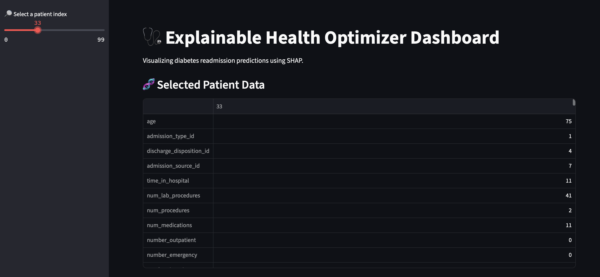
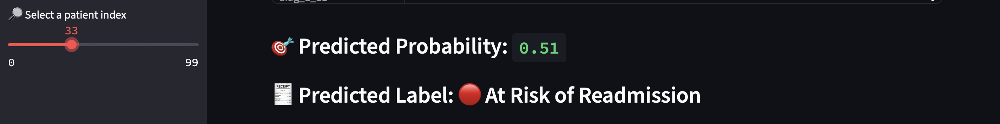
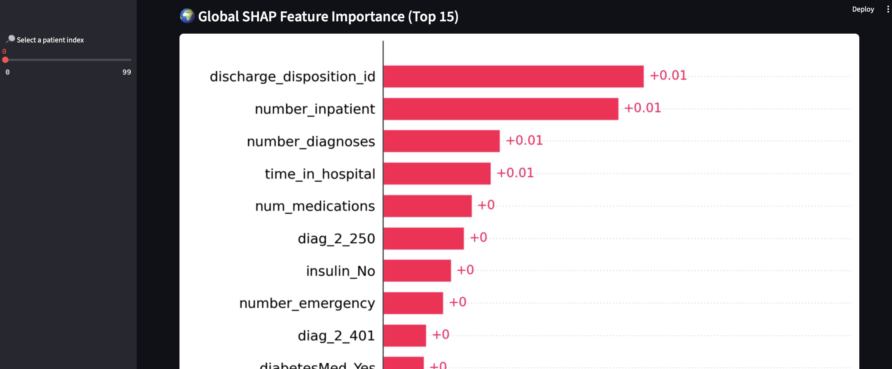
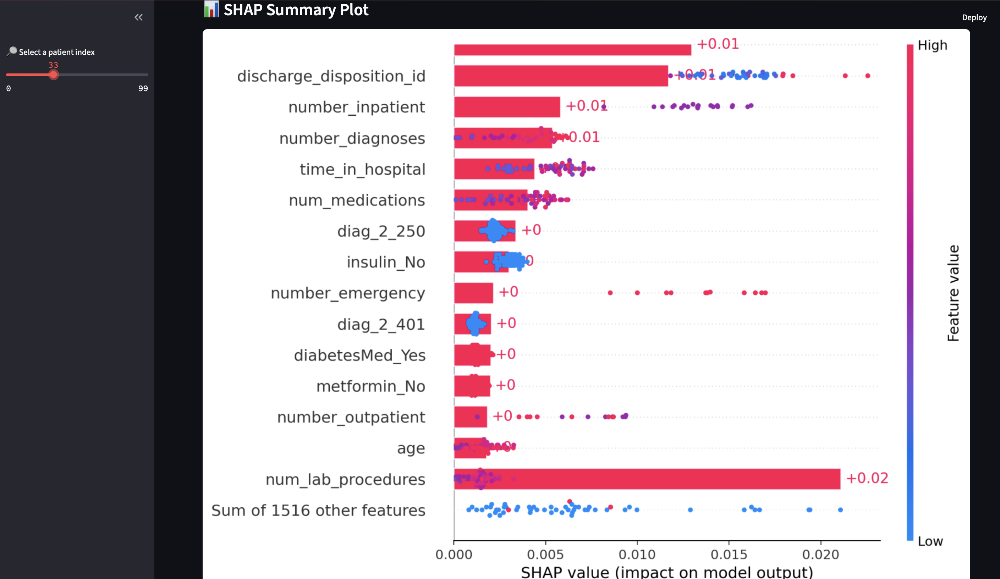
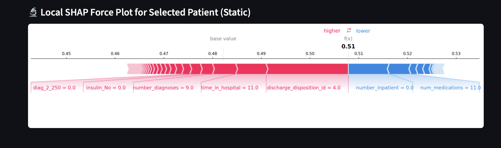

# 🩺 Explainable Health Optimizer

A full-stack ML dashboard for predicting diabetes patient readmission and explaining predictions using SHAP (SHapley Additive exPlanations).

---

## 🚀 Project Overview

This project builds an **interpretable ML pipeline** to predict whether a diabetic patient will be readmitted to a hospital within 30 days. It features:

* 🧹 A cleaned hospital dataset with categorical encoding
* 🌲 A Random Forest & LightGBM model pipeline
* 📊 SHAP for global and local explainability
* 🖥️ A polished **Streamlit dashboard** with multi-model support
* 🧾 Exportable patient report (PDF/CSV)
* 📈 Dependence plots, SHAP waterfall plots, force plots, and more

---

## 📁 Folder Structure

```
explainable-health-optimizer/
├── notebooks/
│   ├── 01_data_cleaning.ipynb
│   ├── 02_model_training.ipynb
│   ├── 03_model_explainability.ipynb
│   ├── models/
│   │   ├── random_forest.pkl
│   │   ├── lightgbm.pkl
│   │   └── best_model.txt
│   └── outputs/
│       ├── cleaned_data.csv
│       ├── shap_input.csv
│       └── shap_values.npy
├── dashboard/
│   └── app.py
├── assets/
│   └── [Dashboard Images]
├── requirements.txt
├── README.md
└── .gitignore
```

---

## 📊 Features

* ✅ Model selection (Random Forest or LightGBM)
* ✅ Patient-specific prediction (probability + label)
* ✅ Local SHAP force plot (interactive)
* ✅ Global SHAP plots (summary, bar, beeswarm)
* ✅ SHAP dependence plot (feature-wise)
* ✅ SHAP waterfall plot (per-patient contribution)
* ✅ Downloadable report (CSV / PDF)
* ✅ UI-polished Streamlit layout

---

## ⚙️ Setup Instructions

### 1. Clone the Repository

```bash
git clone https://github.com/shrey-Bish/explainable-health-optimizer.git
cd explainable-health-optimizer
```

### 2. Create and Activate Virtual Environment

```bash
python3 -m venv venv
source venv/bin/activate  # On Windows: venv\Scripts\activate
```

### 3. Install Dependencies

```bash
pip install -r requirements.txt
```

---

## ▶️ Run the Dashboard

```bash
streamlit run dashboard/app.py
```

> 🧠 Use the sidebar to:

* Select patient index (0 to K)
* Switch between Random Forest / LightGBM
* View detailed SHAP visualizations
* Download patient prediction reports

---

## 🌐 Live Demo

Try the **Explainable Health Optimizer** now on Streamlit Cloud:

🔗 [https://explainable-health-optimizer-diabetes.streamlit.app](https://explainable-health-optimizer-diabetes.streamlit.app)

Explore model predictions, SHAP-based explainability, and patient-specific insights directly in your browser.

---

## 📚 Notebooks Included

| Notebook                        | Purpose                                        |
| ------------------------------- | ---------------------------------------------- |
| `01_data_cleaning.ipynb`        | Cleans raw dataset, encodes, saves cleaned CSV |
| `02_model_training.ipynb`       | Trains RF + LightGBM, saves models             |
| `03_model_explainability.ipynb` | Computes and stores SHAP values for dashboard  |

---

## 🧠 Requirements

* Python 3.9+
* `pandas`, `scikit-learn`, `lightgbm`, `shap`, `matplotlib`, `joblib`, `reportlab`, `streamlit`

Install all using:

```bash
pip install -r requirements.txt
```

---

## 🌟 Sample Visualizations

### 🏠 Dashboard Overview



---

### 🎯 Prediction & Label View



---

### 🌍 Global SHAP Bar Plot



---

### 📈 SHAP Summary Plot



---

### 🔬 Force Plot (Local Explanation)



---

## 🚧 Roadmap / TODO

* [x] Model comparison: Random Forest vs LightGBM
* [x] Local and global SHAP visualization
* [x] Downloadable report (PDF, CSV)
* [x] SHAP dependence + waterfall plots
* [x] Interactive prediction + confidence visualization
* [ ] Deploy to Streamlit Cloud
* [ ] ROC-AUC, confusion matrix panel
* [ ] Patient file upload for predictions

---

## ✍️ Author

**Shrey Bishnoi**
MS in Computer Science, Arizona State University
📍 [LinkedIn](https://www.linkedin.com/in/shrey-bishnoi/) | 💻 [GitHub](https://github.com/shrey-Bish)

---

## 📄 License

**MIT License** – Free to use, modify, and distribute.

---

